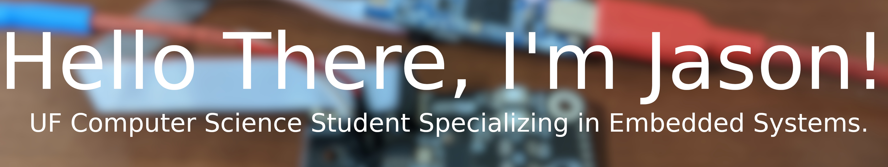
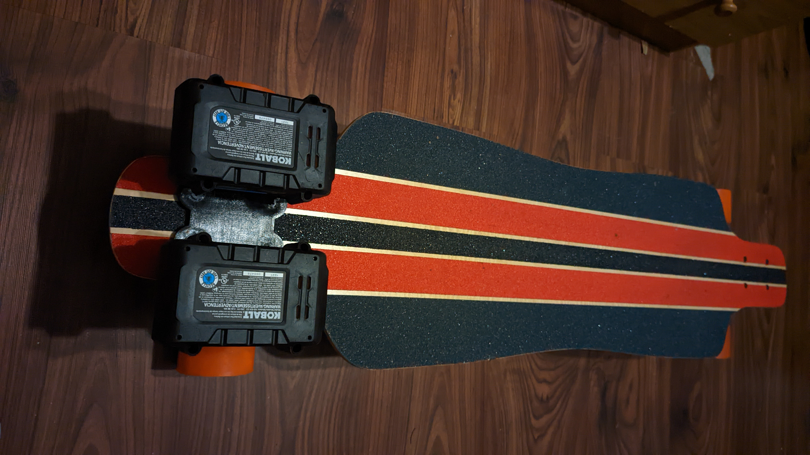

I'm a student at the University of Florida (go gators 🐊!) currently studying computer science and specializing in embedded systems.
I'm a FIRST FRC alumni (go team 3627!) as well as currently being the firmware lead on the UF Formula SAE team (go GMS!).

# My Projects
I've done many things but some of the notable ones include my electric skateboard, light up jacket, a utility to help with theatrical sound on Behringer X32 series consoles, the Vehicle Control Unit firmware for the UF FSAE team, and build infrastructures for Raspberry Pi, RP2040, and STM32 for the FSAE team. 

## Electric Skateboard

I built the skateboard to get around campus at UF. It is powered by a single 24V Kobalt tool battery (two are pictured here but this was an older version) as they are cheap, easily accessible, and offer good protection features. It uses a single REV Robotics Spark Max ESC and a REV Robotics NEO motor in a single belt driven wheel configuration; this configuration provides about 1000 watts of peak power and a top speed of 30 miles per hour. The Spark Max ESC is a powerful brushless ESC used primally in FRC but I decided to try to reverse engineer it's CAN network protocol and control it with an ESP8266 and I was successful. I plan on uploading the full reverse engineered non-FRC protocol soon as well as possible a small header only c library for using it. Perhaps the coolest part is that all parts in the skateboard are standard off the shelf components or 3D printable by a standard FDM printer so I can get replacement parts very easily wherever I go. It uses a small rechargeable 3D printed handheld trigger style remote also using an ESP8266 with a small OLED screen. Everything communicates over ESP-NOW as it's easy, fast, and reliable. I also plan on upgrading the ESP8266s to ESP32s so I can have bluetooth support for things like locking and unlocking, tracking trips, and getting battery life estimates from a smart phone.