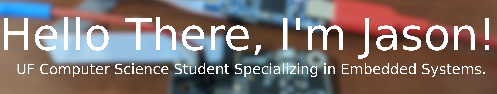

I'm a student at the University of Florida (go gators 🐊!) currently studying computer science and specializing in embedded systems.
I'm a FIRST FRC alumni (go team 3627!) as well as being an FSAE alumni (go Gator Motorsports and Universty of Florida) after three years of serving as its first firmware lead.

# My Projects
I've done many things but some of the notable ones include my [electric skateboard](projects/skateboard.md), light up jacket, a utility to help with theatrical sound on Behringer X32 series consoles, the Vehicle Control Unit and Battery Control Unit firmware for the UF FSAE team.
This firmware required building out infrastructure for a real-time Linux box, RT1176 microcontrollers, embedded Rust, and a lot of off-target and on-target testing.
